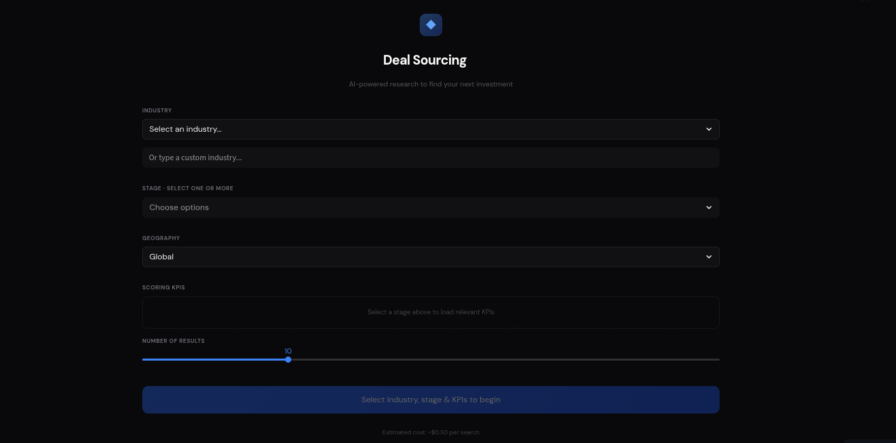

# Deal Sourcing

**AI-powered VC deal sourcing tool. Select an industry, stage, and scoring KPIs — Claude searches the web in real-time to find actual startups matching your investment criteria, scores them 0–100, and exports to CSV.**

Most deal sourcing is manual: analysts grinding through Crunchbase, PitchBook, and LinkedIn. This tool compresses the top-of-funnel screen into a single query — pick your sector and stage, define what matters, and get scored results in seconds.


<!-- Replace with actual screenshot -->

**[Try the Live Demo →](your-streamlit-url)**

---

## How It Works

```
Industry + Stage + KPIs → Claude (with web search) → Scored startup list → CSV export
```

Each stage (Pre-Seed through Growth) maps to a default set of KPIs relevant to that maturity level. You can add custom KPIs on top. Claude searches the web live, finds real companies, and scores each one 0–100 against your criteria.

**Stack:** Python · Streamlit · Claude Sonnet (Anthropic, web search enabled)

## Features

- Stage-mapped KPIs — Pre-Seed through Growth, each with relevant default scoring criteria
- Live web research — Claude searches in real-time to find actual companies, not synthetic examples
- KPI match scoring — each result scored 0–100 against your selected criteria
- CSV export — download results for your pipeline or CRM
- Custom KPIs — layer your own scoring criteria on top of defaults

## Project Structure

```
├── app.py           # Main Streamlit app
├── config.py        # Industries, stages, KPI mappings
├── research.py      # Claude API + web search logic
└── requirements.txt
```

## Quickstart

```bash
git clone https://github.com/your-repo/deal-sourcing.git
cd deal-sourcing
pip install -r requirements.txt
```

Add your API key to `.streamlit/secrets.toml`:

```toml
ANTHROPIC_API_KEY = "sk-ant-your-key-here"
```

```bash
streamlit run app.py
```

Each search costs ~$0.02–0.05 in Claude API usage depending on result count and search depth.

## Built By

**[Karan Rajpal](https://www.linkedin.com/in/krajpal/)** — UC Berkeley Haas MBA '25 · LLM Validation @ Handshake AI (OpenAI/Perplexity) · Former 5th hire at Borderless Capital
